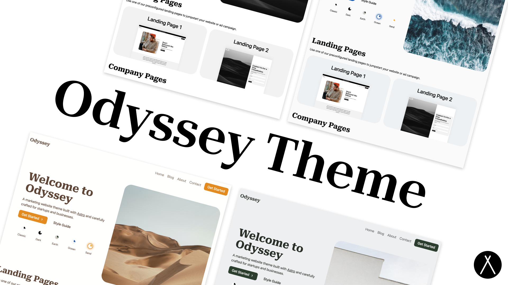
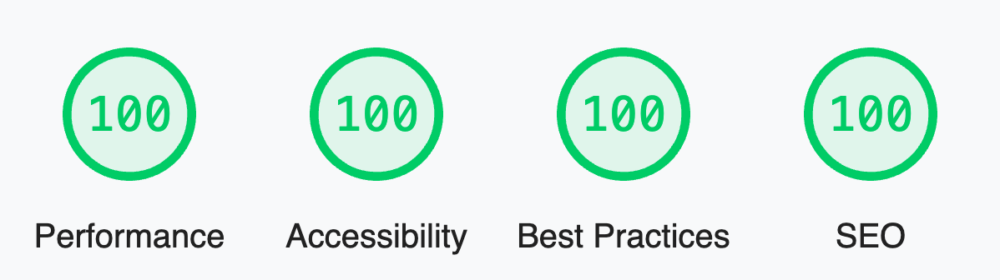

<p align="center">
  
</p>

<br/>
<div align="center">
  <a href="https://twitter.com/jaydanurwin">
  
</a>
  <a href="https://sapling.lemonsqueezy.com/checkout/buy/9b78751f-6382-442d-ac99-32c2318b70a0">
    
  </a>
</div>
<br/>

# Odyssey Theme

Odyssey Theme is a modern theme/starter for a business or startup's marketing website. It provides landing page examples, a full-featured blog, contact forms, and more. It is fully themeable to match your business' branding and style. It even includes a theme switcher component to show how easily the entire style of the site can be changed with only a few lines of CSS.

## Features

<p align="center">
  
</p>


- ✅ **A perfect score in Lighthouse**
- ✅ **Blazing fast performance thanks to Astro 🚀**
- ✅ **A Full Featured Blog with Tagging**
- ✅ **Fully theme-able styles with for buttons, shapes, backgrounds, surfaces, etc.**
- ✅ **Responsive, mobile-friendly landing pages**
- ✅ **SEO Best Practices (Open Graph, Canonical URLs, sitemap)**
- ✅ **Performant Local Fonts Setup**
- ✅ **Contact Forms Setup for Netlify, Formspree, Formspark, etc.**
- ✅ **A package of ready-to-use UI components**


## Demo

View a [live demo](https://odyssey-theme.sapling.supply/) of the Odyssey Theme.

## Documentation

1. View the [Theme Setup Guide](https://odyssey-theme.sapling.supply/theme/theme-setup)
2. View the [Customizing the Theme Guide](https://odyssey-theme.sapling.supply/theme/customizing-odyssey)

## Usage

```bash
cd theme

npm install

npm start
```

## Deploy

Feel free to deploy and host your site on your favorite static hosting service such as Netlify, Firebase Hosting, Vercel, GitHub Pages, etc.

Astro has [an in-depth guide](https://docs.astro.build/en/guides/deploy/) on how to deploy an Astro project to each service.

## Google Search Console

The site is prepared for Google Search Console (sitemap, robots.txt, verification meta tag). **Full setup checklist:** see [docs/Google-Search-Console.md](docs/Google-Search-Console.md).

- **Sitemap**: Built at `/sitemap.xml` (see `public/robots.txt`). After deploy, add property and submit **Sitemaps** → `sitemap.xml`.
- **Verification**: Use the HTML tag method; set `PUBLIC_GOOGLE_SITE_VERIFICATION` in `.env` (see `.env.example`), rebuild and deploy, then click Verify in Search Console.

## Best practices (real estate / local SEO)

- **JSON-LD**: Every page includes `WebSite`, `RealEstateAgent`, and `Person` schema (NAP, contact, address, sameAs for E-E-A-T) in `BaseHead.astro` for GBP and rich results.
- **Meta**: Viewport with `initial-scale=1`, canonical URL, Open Graph (locale, site_name, image, image width/height), Twitter (card, site, creator, image dimensions).
- **FAQ**: `src/config/settings.js` has a `faq` array; `FAQSection.astro` renders it on the About page and outputs `FAQPage` JSON-LD for rich results and GBP.
- **Security**: `vercel.json` sets `X-Content-Type-Options: nosniff`, `X-Frame-Options: SAMEORIGIN`, `Referrer-Policy: strict-origin-when-cross-origin`, and **Content-Security-Policy** allowing `self`, Calendly (`assets.calendly.com`, `calendly.com`), WidgetBe (`widgetbe.com`), and `https:` for images (e.g. RSS from `files.keepingcurrentmatters.com`). Adding new third-party scripts or styles requires updating the CSP in `vercel.json`.
- **Accessibility**: Images use descriptive `alt`; Calendly inline widget has `aria-label`; testimonial controls use `aria-label`.
- **NAP**: Contact details live in `src/config/settings.js`; footer and schema read from there so NAP stays consistent.

### Monthly audit (GBP and compliance)

Run monthly (or when GBP details change):

- **NAP consistency:** Visible NAP (footer, contact pages) and JSON-LD in `BaseHead.astro` match `src/config/settings.js` and Google Business Profile.
- **Schema vs GBP:** RealEstateAgent/Person schema matches GBP name, address, phone, hours if you add `openingHours`.
- **RealScout (IDX):** MLS disclaimer and listing attribution present where listings are shown; no unauthorized changes to RealScout (office IDX) widget/integration.
- **Mobile and content:** Key pages mobile-friendly; dates and copy up to date.

See `docs/Lead-Flow-and-CRM.md` for lead flow and CRM alignment; `AGENTS.md` and `.cursor/rules/` for agent guardrails.

## Winning appointments (measure, review, iterate)

The site is set up to **evolve toward more booked calls** by measuring where bookings come from and iterating on copy and placement.

### Define your "win" metric

Choose a target you can track, for example:

- **X booked calls per month** from the website (use Calendly + UTM to count), or
- **Y% of Calendly opens that become bookings** (compare GA4 `calendly_open` events to Calendly completed bookings).

### What’s already in place

- **UTM on every Calendly link**: `utm_source=consenzaestates`, `utm_medium=web`, and a distinct `utm_campaign` per page/section (e.g. `header`, `home_hero`, `contact_inline`, `resources_cta`, `lennar_cta`). Set via the `utmCampaign` prop on `CalendlyLink` and `CalendlyInline`; base URL built in `settings.calendly.urlWithUtm(campaign)`.
- **GA4**: Set `PUBLIC_GA4_MEASUREMENT_ID` in `.env` (e.g. `G-XXXXXXXXXX`) to enable Google Analytics 4. A custom event **`calendly_open`** fires when a user clicks a Calendly link (with `campaign` in the event params), so you can see “clicks to book” by campaign in GA4.
- **Appointment-first CTAs**: One primary “book” CTA per page with benefit-led copy and a short trust line (“Free 15‑minute call — no obligation”) where relevant.

### 2-week review process

1. **In Calendly**: Filter or export bookings where the invitee source/link includes `utm_source=consenzaestates` (or use Calendly’s UTM reporting if available). Break down by `utm_campaign` to see which campaigns drive the most **bookings**.
2. **In GA4**: Open **Reports → Engagement → Events** and look at **`calendly_open`**. Use the `campaign` parameter to see which campaigns drive the most **opens**. Compare opens to bookings to see where drop-off happens.
3. **Decide one change**: e.g. strengthen CTA copy on the top-converting campaign, add a CTA to a high-traffic page with few opens, or test different header CTA text. Keep UTM and campaign names consistent so the next review is comparable.
4. **Run for 1–2 weeks** (or until you have enough data, e.g. 50+ `calendly_open` events), then repeat. Double down on what drives bookings; adjust or remove what doesn’t until you hit your “win” target.

## Sponsor

If you find this theme useful, please consider donating to support the continued development of it with the link below

[Donate to Odyssey Theme](https://sapling.lemonsqueezy.com/checkout/buy/9b78751f-6382-442d-ac99-32c2318b70a0)

## Support

Please feel free to post issues or submit PRs to this repo and we will do our best to respond in a timely manner, keeping in mind this template is offered for free as is on GitHub.
